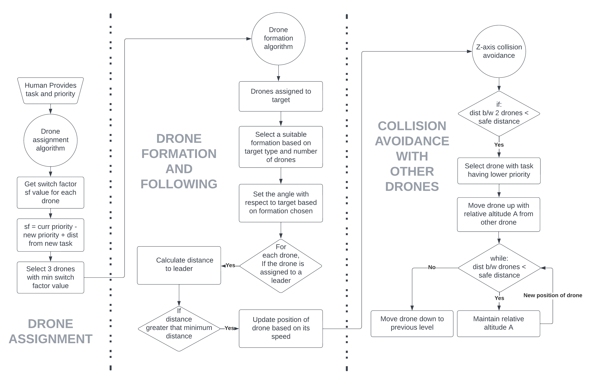

<H1 align="center">Drone-Swarm-Filming-Simulation</H1>
<H3 align="center"> Simulation to showcase our algorithms for using a drone swarm to effectively film events.</H3>

## How it works
- The Drone Assignment Algorithm will assign drones.
- The Drone Formation Algorithm will pick a suitable filming formation.
- The Drone Following Algorithm will follow the target in formation, keeping a safe distance.
- The Z-Axis Collision Avoidance Algorithm will prevent drones from colliding into each other.

## Architecture Diagram


## Steps to run Code

- Clone the repository
```
git clone https://github.com/Sahil-Amritkar/Drone-Swarm-Filming-Simulation.git
```

- Goto the cloned folder.
```
cd Drone-Swarm-Filming-Simulation
```

- install pygame
```
pip install pygame
```

- Run drone_simulation.py
```
python drone_simulation.py
```

## Interacting with the Simulation

- The drones are initialized randomly on the map.
- The targets move randomly across the map.
- To assign drones to a target, click it.
- Drones will be assigned to the target and start following it in a selected formation.


## Upcoming Features

- Rotation of drones around the target.
- Dynamic filming formations.
- Auto reassignment of drones.
- Make drones predict path of target and position themselves accordingly to film, using AI.
